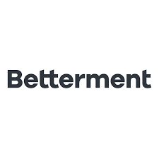

# Betterment FinTech Case Study

## Contributors
* Chrisitan
* M.D.
* Katie
* Jorge
* Travis

### Betterment Case Study Content

#### Who is Betterment?
Betterment is a new robo adviser that automatically manages individuals' portfolios.  They use specific algorithms to tailor portofolios to an individuals risk tolerance.  Their main competitors are Vanguard, Robinhood, and SoFi.

#### How does Betterment use Technology?

#### What sets Betterment apart in FinTech?

#### What is the future for Betterment?

